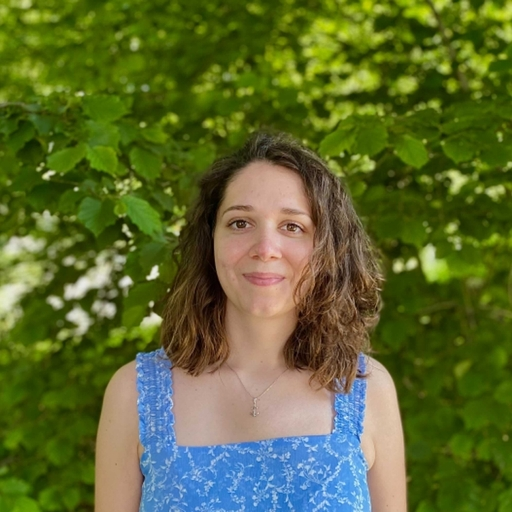
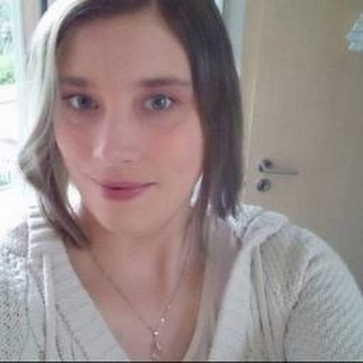
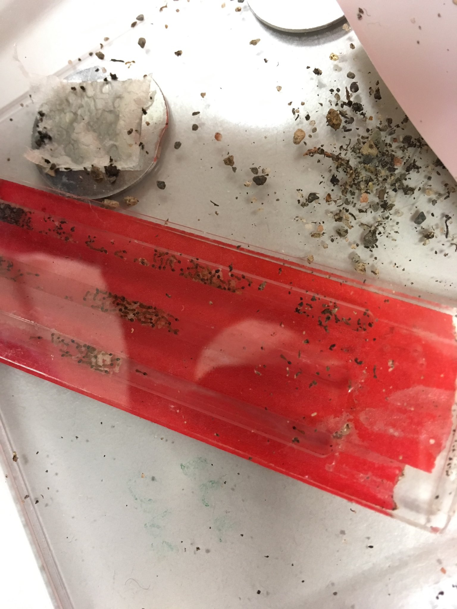
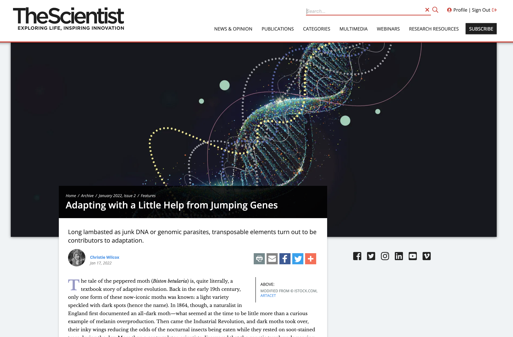
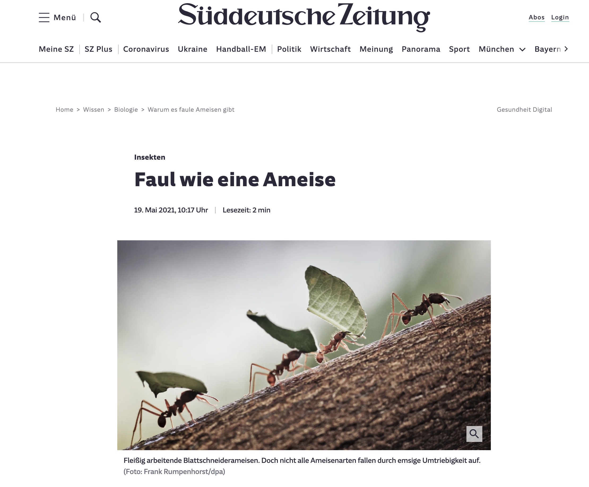
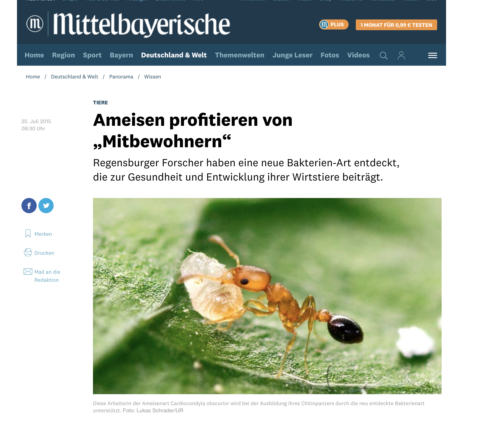

```{r setup, include=FALSE}
library(flexdashboard)
library(scholar)
library(knitr)
library(ggplot2)
library(cowplot)
library(tidyverse)
library(kableExtra)
```

```{r theme-set}
theme_set(theme_cowplot(font_size=5))
```

```{r scholar}
#Define the person to analyze
scholar_id=c("sH4_TPkAAAAJ","59ha_gEAAAAJ")
#either load existing file of publications
#or get a new one from Google Scholar
#delete the file to force an update
#get citations
cites<-list()
num_articles<-list()
papers<-list()
auth.profile<-list()

for (i in scholar_id){
cites[[i]] <- scholar::get_citation_history(i) 
num_articles[[i]]<-scholar::get_num_articles(i)
papers[[i]]<-scholar::get_publications(i)
auth.profile[[i]]<-scholar::get_profile(i)
}

cites.total <- scholar::get_citation_history(scholar_id[1]) 
num_articles.total<-scholar::get_num_articles(scholar_id[1])
papers.total<-scholar::get_publications(scholar_id[1])


#saveRDS(cites,'citations.Rds')

# manual curation
auth.profile[[2]]$name<-"Mohammed Errbii"

```


Team {data-icon="fa-user-friends"}
=============================

Row {data-height=55}
--------------------------------------

### 

```{r people}
people <- 8
valueBox(value = people,icon = "fa-user-friends",caption = "Group members",color = "green")
```

### Publications
```{r}
valueBox(value = num_articles.total,icon = "fa-file-alt",caption = "Publications", color = "steelblue")
```

### Citations
```{r}
valueBox(value = sum(cites.total$cites),icon = "fa-broadcast-tower",caption = "Citations", color = "coral")
```

### Ants
```{r}
valueBox(value = sample(100000:1000000,1),icon = "fa-bug",caption = "Ants studied", color = "orange")
```

```{r}
#This site will host content related to the Insect Evolutionary Genomics lab at the WWU Münster.
```

Row {}
----------------------------------
### People

<div class="people">
  <p class="people">
    <b>
  Mohammed "Simo" Errbii
  </b>  &rarr; 
  Population genomics and genome evolution in ants. 
  <br>
  </p>
</div>


<br>
<div class="people">
  <p class="people">
  
  <b>
  Rebecca Rothering
  </b>  &rarr; 
  The evolutionary significance of TEs in ants.
  <br>
  </p>
</div>

<br>
<div class="people">
  <p class="people">
  
  <b>
  Esther van den Boes
  </b>  &rarr; 
  Rapid evolution and TE-induced genetic variation in invasive ants.
  <br>
  </p>
</div>

<br>
<div class="people">
  <p class="people">
  
  <b>
  Janina Rinke
  </b>  &rarr; 
  The impact of horizontal gene transfers in ants.
  <br>
  </p>
</div>

<br>
<div class="people">
  <p class="people">
  
  <b>
  Nic Schröder
  </b>  &rarr; 
  Ant virome evolution and evolutionary genomics of insect endosymbionts.
  <br>
  </p>
</div>

<br>
<div class="people">
  <p class="people">
  
  <b>
  Maja Drakula
  </b>  &rarr; 
  Colony recognition and self-/non-self discrimination in invasive ants.
  <br>
  </p>
</div>

<br>
<div class="people">
  <p class="people">
  
  <b>
  Nadine Kortüm
  </b>  &rarr; 
  Molecular characterization of ant LGTs.
  <br>
  </p>
</div>

<br>
<div class="people">
  <p class="people">
  
  <b>
  Lukas Schrader
  </b>  &rarr; 
  All of the above
  <br>
  </p>
</div>

<br><br>

**Former Members:**

  - **Lena Wiegert:** Canalization and phenotypic diversification in Cardiocondyla obscurior.
  - **Svenja Kieckhäfer:** The role of cuticular hydrocarbons in desiccation resistance in ants
  - **Eyleen Wiese:** The genetic basis of CHC biosynthesis in ants


### {data-width=100}
####





<br>
<br>
<br>
<br>
© 2021 Schrader lab
<br>
All rights reserved.


Publications {data-icon="fa-file-alt"}
=============================

Row {.tabset}
-----------------------------
```{r publications-functions}

paperPlots <- function(author.number) {
  p1<-ggplot(cites[[author.number]],aes(x=as.factor(year),y=cites))+
    geom_bar(stat="identity",fill="steelblue")+
    xlab(NULL)+ylab("# citations")+
    theme(axis.text.x = element_text(angle = -45, vjust = 0.5, hjust=0.1))
  
  
  pap.year<-plyr::count(papers[[author.number]]$year)
  p2<-ggplot(pap.year,aes(x=as.factor(x),y=freq),fill="black")+
    geom_bar(stat="identity",fill="steelblue")+
    xlab(NULL)+ylab("# publications")+
    theme(axis.text.x = element_text(angle = -45, vjust = 0.5, hjust=0.1))
  plot_grid(p1,p2,nrow=1)
}

paperTab <- function(author.number) {
  paperTable<-papers[[author.number]][order(papers[[author.number]]$year,decreasing = T),c(1,2,3,6)]
  colnames(paperTable)<-c("Title","Authors","Journal","Year")
  kbl(paperTable, caption = paste(nrow(paperTable)," publications (co-)authored by", auth.profile[[author.number]]$name,"([google scholar](https://scholar.google.de/citations?user=sH4_TPkAAAAJ))"),row.names = F) %>% kable_styling(bootstrap_options = c("striped", "hover"))
}

```


### `r author.number<-1; auth.profile[[author.number]]$name`
#### 

```{r fig.height=1.5, fig.width=4}
paperPlots(author.number)
```

####
<div class="publication">
```{r}
paperTab(author.number)
```
</div>


### `r author.number<-2; auth.profile[[author.number]]$name`
#### 
```{r fig.height=1.5, fig.width=4}
paperPlots(author.number)
```


####
<div class="publication">
```{r}
paperTab(author.number)
```
</div>

Research {data-icon="fa-wrench"}
=============================
Row {.tabset}
-----------------------------
### **Genome Evolution in ants**

### **GAGA**

### **Canalization and phenotypic robustness in ants**

Funding {data-icon="fa-hand-holding-usd"}
=============================

####
The work in our group is made possible by generous funding from the German Research Foundation DFG, the *Santander Mobilitätsfonds*, and the SAFIR funding program.

####


####


####


Press coverage {data-icon="fa-bullhorn"}
=============================

<br>
<div class="press">
<p class="press">
[](https://www.the-scientist.com/features/adapting-with-a-little-help-from-jumping-genes-69566)
**The Scientist** *Adapting with a Little Help from Jumping Genes*
<br> 
[This beautiful article](https://www.the-scientist.com/features/adapting-with-a-little-help-from-jumping-genes-69566) from 2022 features [our work](https://onlinelibrary.wiley.com/doi/10.1111/mec.16099) on the impact of transposable elements in invasive Cardiocondyla. 
<br>
</p>
</div>

<br>
<div class="press">
<p class="press">
[](https://www.sueddeutsche.de/wissen/ameisen-schmarotzer-soziale-insekten-faulheit-insekten-parasiten-1.5297646)
**Süddeutsche Zeitung** *Faul wie eine Ameise*
<br> 
The title roughly translates to [*lazy as an ant*](https://www.the-scientist.com/features/adapting-with-a-little-help-from-jumping-genes-69566) and the article from 2021 summarizes our [findings on genome erosion](https://www.nature.com/articles/s41467-021-23178-w) in socially parasitic species of *Acromyrmex*. 
<br>
</p>
</div>

<br>
<div class="press">
<p class="press">
[](https://www.mittelbayerische.de/wissen-nachrichten/ameisen-profitieren-von-mitbewohnern-21981-art1261988.html)
**Mittelbayrische Zeitung** *Ameisen profitieren von „Mitbewohnern“*
<br> 
[This article published in 2015](https://www.mittelbayerische.de/wissen-nachrichten/ameisen-profitieren-von-mitbewohnern-21981-art1261988.html) in the Mittelbayerische Zeitung focuses on our discovery of [the ant endosymbiont *Westeberhardia*](https://www.nature.com/articles/ismej2015119), which is named after the great Mary-Jane West-Eberhard. 
<br>
</p>
</div>

<br>
<div class="press">
<p class="press">
[](https://idw-online.de/en/news619133)
**Süddeutsche Zeitung** *Faul wie eine Ameise*
<br> 
This [press release from 2014](https://idw-online.de/en/news619133) highlights our characterization of [TE islands]( www.nature.com/ncomms/2014/141216/ncomms6495/full/ncomms6495.html) in the ant *Cardiocondyla obscurior*. 
<br>
</p>
</div>


Contact {data-icon="fa-envelope"}
=============================

If you’re interested in joining us, send an email to Lukas.Schrader[at]wwu.de. Projects should address open evolutionary or ecologically questions include population genomics, comparative analyses, molecular biology, field work or behavioral experiments.


<!---
Pictures {data-icon="fa-camera"}
=============================


-->