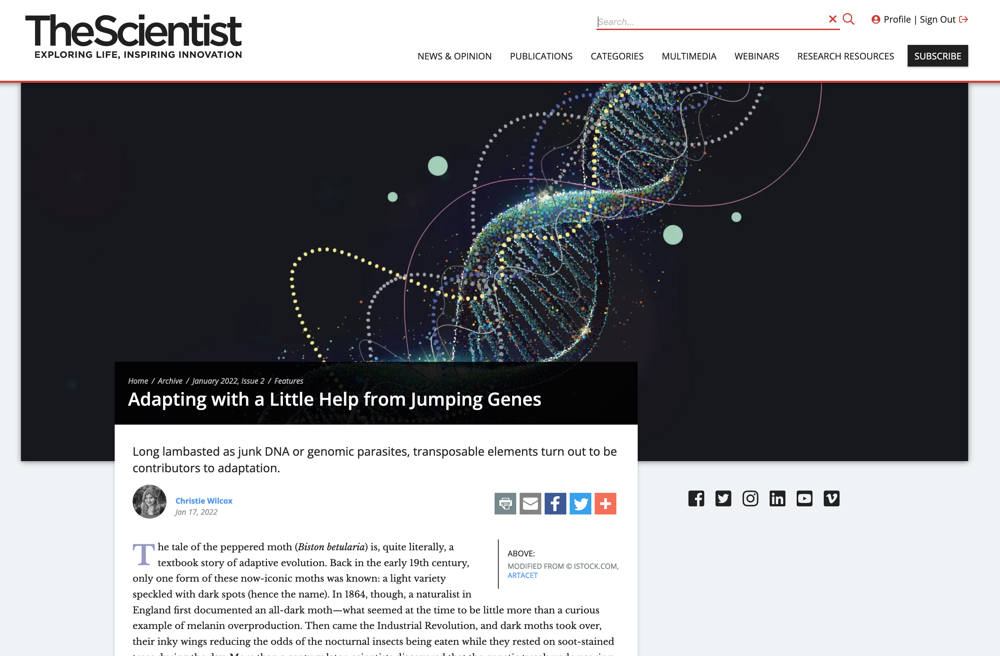
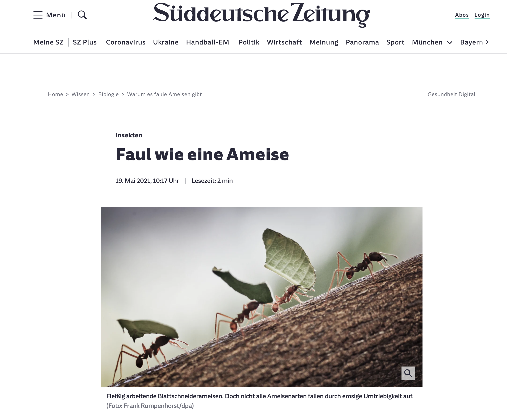
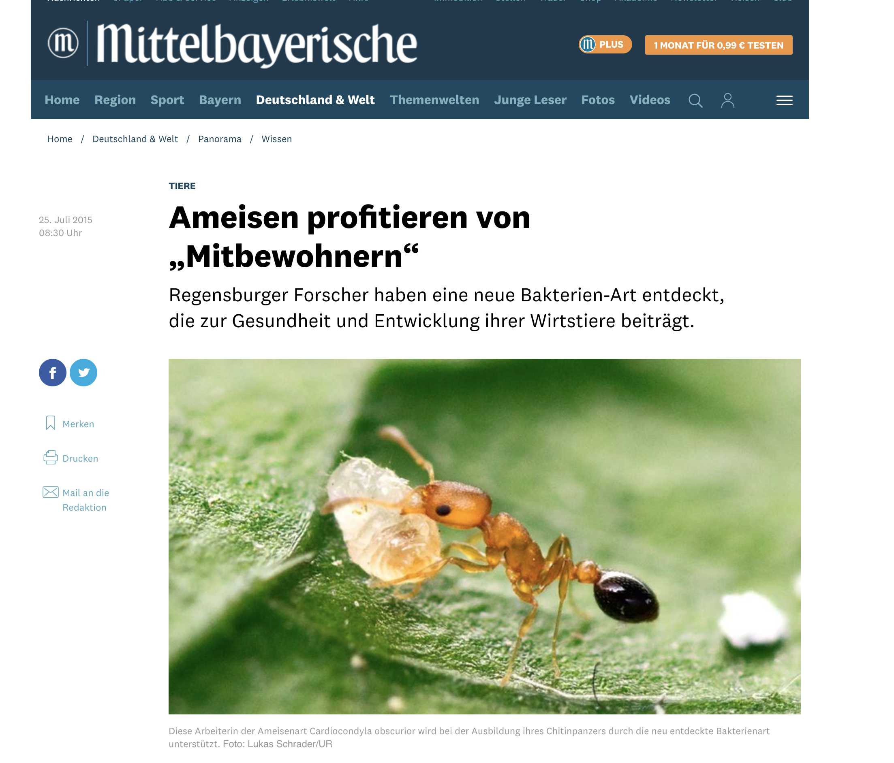
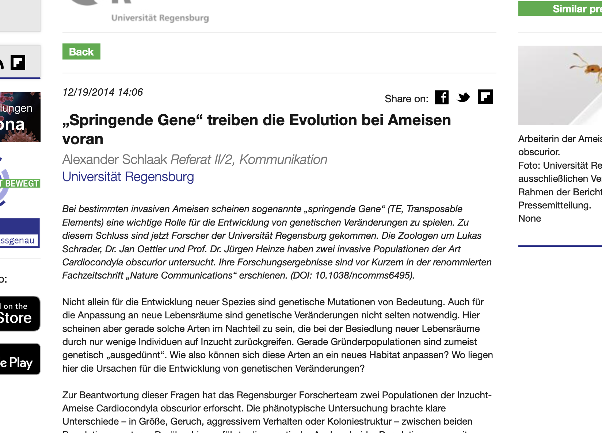

 

**The Scientist** *Adapting with a Little Help from Jumping Genes*
  
[This beautiful article](https://www.the-scientist.com/features/adapting-with-a-little-help-from-jumping-genes-69566) from 2022 features [our work](https://onlinelibrary.wiley.com/doi/10.1111/mec.16099) on the impact of transposable elements in invasive Cardiocondyla. 
 

 

**Süddeutsche Zeitung** *Faul wie eine Ameise*
  
The title roughly translates to [*lazy as an ant*](https://www.the-scientist.com/features/adapting-with-a-little-help-from-jumping-genes-69566) and the article from 2021 summarizes our [findings on genome erosion](https://www.nature.com/articles/s41467-021-23178-w) in socially parasitic species of *Acromyrmex*. 
 

 

**Mittelbayrische Zeitung** *Ameisen profitieren von „Mitbewohnern“*
  
[This article published in 2015](https://www.mittelbayerische.de/wissen-nachrichten/ameisen-profitieren-von-mitbewohnern-21981-art1261988.html) in the Mittelbayerische Zeitung focuses on our discovery of [the ant endosymbiont *Westeberhardia*](https://www.nature.com/articles/ismej2015119), which is named after the great Mary-Jane West-Eberhard. 
 

 

**Press release** *„Springende Gene“ treiben die Evolution bei Ameisen voran*
  
This [press release from 2014](https://idw-online.de/en/news619133) highlights our characterization of [TE islands]( www.nature.com/ncomms/2014/141216/ncomms6495/full/ncomms6495.html) in the ant *Cardiocondyla obscurior*. 
 

