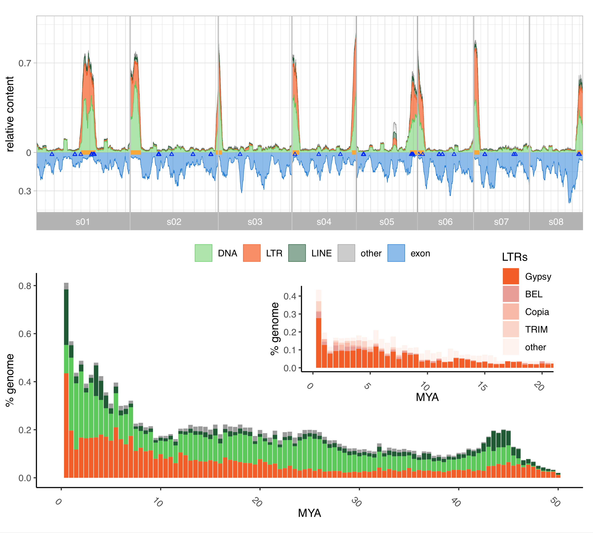
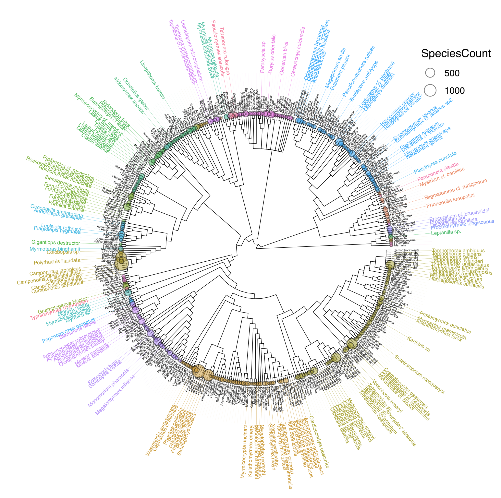
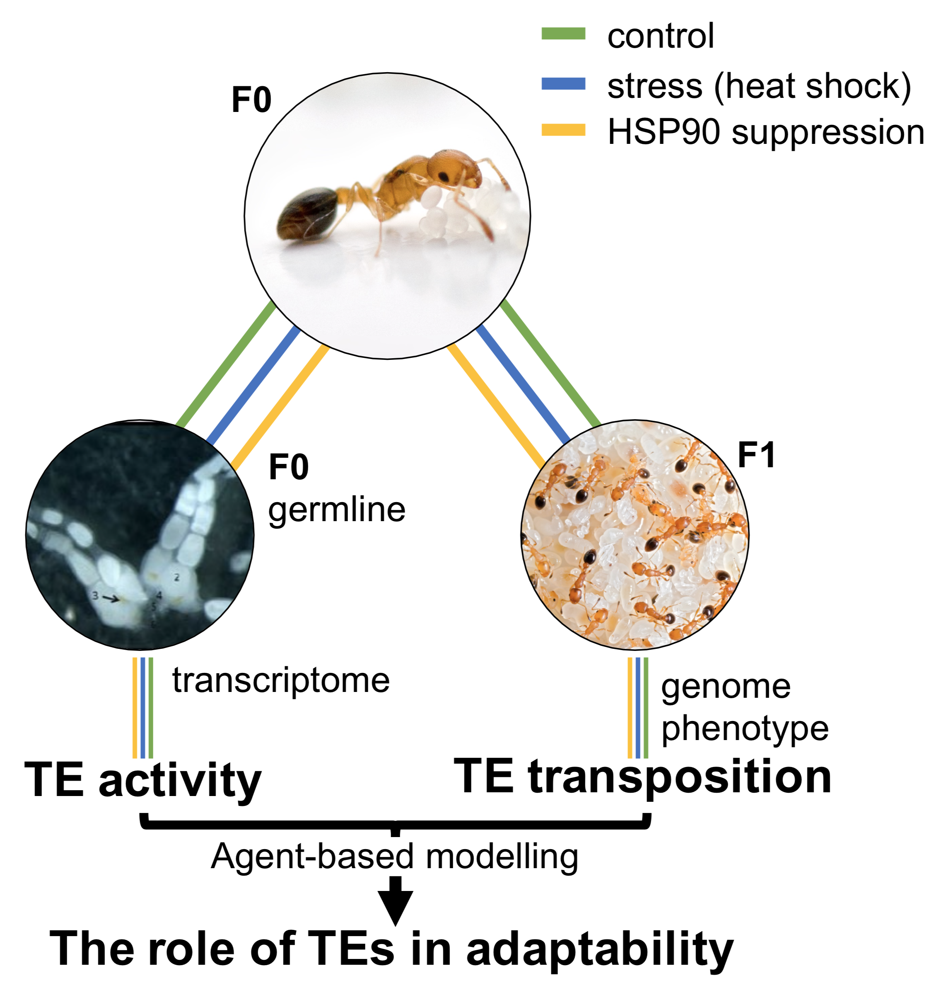

## {.tabset}

### **Rapid genome evolution**

Structural variants, defined as stretches of DNA that differ in copy number (deletions, insertions and duplications), orientation (inversions) or chromosomal location (translocations) between individuals, are the largest source of inter-individual genetic variation. Such complex rearrangements can be caused by a single mutagenic event and account for most of the variation between genomes. For example in humans, any two humans will on average differ in copy number across 0.78% of their genomes!

Structural variation can have devastating fitness consequences, but there is sufficient evidence to also conclude that they provide a rich basis for adaptive evolution. Different to single nucleotide variants, structural variants are much more likely to have a large effect on an individual’s phenotype, because they affect more than a single base (see for example, the loss of pelvic appendages in freshwater stickle-back populations, Chan et al. 2010). The relatively high frequency of structural variants in natural populations, their origin from single mutagenic events and their potential for causing considerable phenotypic change make structural variants a relevant research subject for studying rapid adaptation.
We explore the origins, prevalence, and consequences of structural variation in the invasive ant <i>Cardiocondyla obscurior</i> a genomic model for eusocial evolution,  which shows considerable phenotypic variation across different introduced populations. Intriguingly, in introduced populations, genetic bottlenecks and increased inbreeding reduces efficiency of selection, while the instantaneous exposure to a novel environment opens up potential (and demand) for rapid evolutionary change. Therefore, mildly adaptive small-effect variants (e.g. SNVs) caused by mutations, retrotransposons or doublestrand-break DNA repair are more likely to be lost through drift and are thus less likely to contribute to adaptation. Hence, larger structural variants conferring larger phenotypic effects should be particularly important under this scenario. Indeed, structural variation have repeatedly been shown to confer adaptations to novel environments.
 
 

### **GAGA**

The Global Ant Genomics Alliance (GAGA) was initiated in 2015 mainly by Guojie Zhang (University of Copenhagen, China National GeneBank, Kunming Institute of Zoology), Jacobus (Koos) Boomsma (University of Copenhagen), and Lukas Schrader and has prospered into a global collaboration with a network of over 120 collaborators from 25 countries (visit [antgenomics.dk](antgenomics.dk) for further details). GAGA’s primary goal is to generate comprehensive genomic, transcriptomic and phenotypic resources for over 200 species selected from across the ant phylogeny. For each species, we aim to produce (1) a high-quality genome assembly (using a com- bination of PacBio, and stLFR- or HiC-sequencing), (2) gene expression data from queens and workers (using short reads), (3) microbial symbioses datasets using metagenomic 16S-rDNA sequencing, (4) (macro-)eco- logical datasets, and (5) morphological datasets from micro-CT scans.
 
 

### **Transposable elements and genetic innovation**

Genome evolution is a much more dynamic process than originally presumed. Present in virtually every genome, transposable elements (TEs) are important players in this, as they actively (transposition) and passively (e.g. aberrant recombination) generate novel genetic mutations and rearrangements. TEs thus play a key role in the genetic differentiation of individuals, populations, and species. We try gaining a better understanding of TEs in genome evolution and their role as a creative force in adaptive processes. For this, we study their impact in <i>Cardiocondyla obscurior</i>, a species of invasive ants whose genome is compartmentalized in fast evolving TE-rich and slowly evolving TE-poor regions. Specifically, we address (1) whether TEs can increase adaptability in this species, (2) whether selective activity of TEs in the worker caste can generate adaptive genetic diversity, and (3) whether the HSP90-dependent cellular stress response contributes to the interplay of environment and TE activity. Our researchcombines transcriptomics, genomics, and agent-based simulations to expand our knowledge of the role of TEs in evolution and how invasive species cope with constantly changing environments.
 
 

### **Canalization and phenotypic robustness**

### **Phenotypic plasticity**

### **Evolutionary capacitators**

### **Invasion biology**

