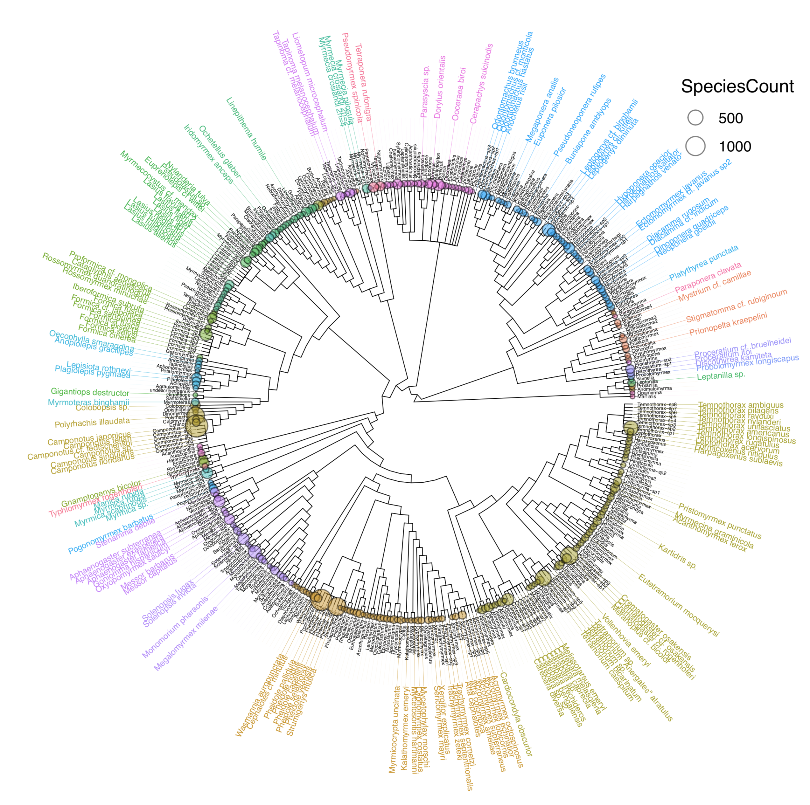

## {.tabset}

### **Rapid genome evolution**

### **GAGA**

The Global Ant Genomics Alliance (GAGA) was initiated in 2015 mainly by Guojie Zhang (University of Copenhagen, China National GeneBank, Kunming Institute of Zoology), Jacobus (Koos) Boomsma (University of Copenhagen), and Lukas Schrader and has prospered into a global collaboration with a network of over 120 collaborators from 25 countries (visit [antgenomics.dk](antgenomics.dk) for further details). GAGA’s primary goal is to generate comprehensive genomic, transcriptomic and phenotypic resources for over 200 species selected from across the ant phylogeny. For each species, we aim to produce (1) a high-quality genome assembly (using a com- bination of PacBio, and stLFR- or HiC-sequencing), (2) gene expression data from queens and workers (using short reads), (3) microbial symbioses datasets using metagenomic 16S-rDNA sequencing, (4) (macro-)eco- logical datasets, and (5) morphological datasets from micro-CT scans.
 
 

### **Canalization and phenotypic robustness**

### **Phenotypic plasticity**

### **Evolutionary capacitators**

### **Invasion biology**

