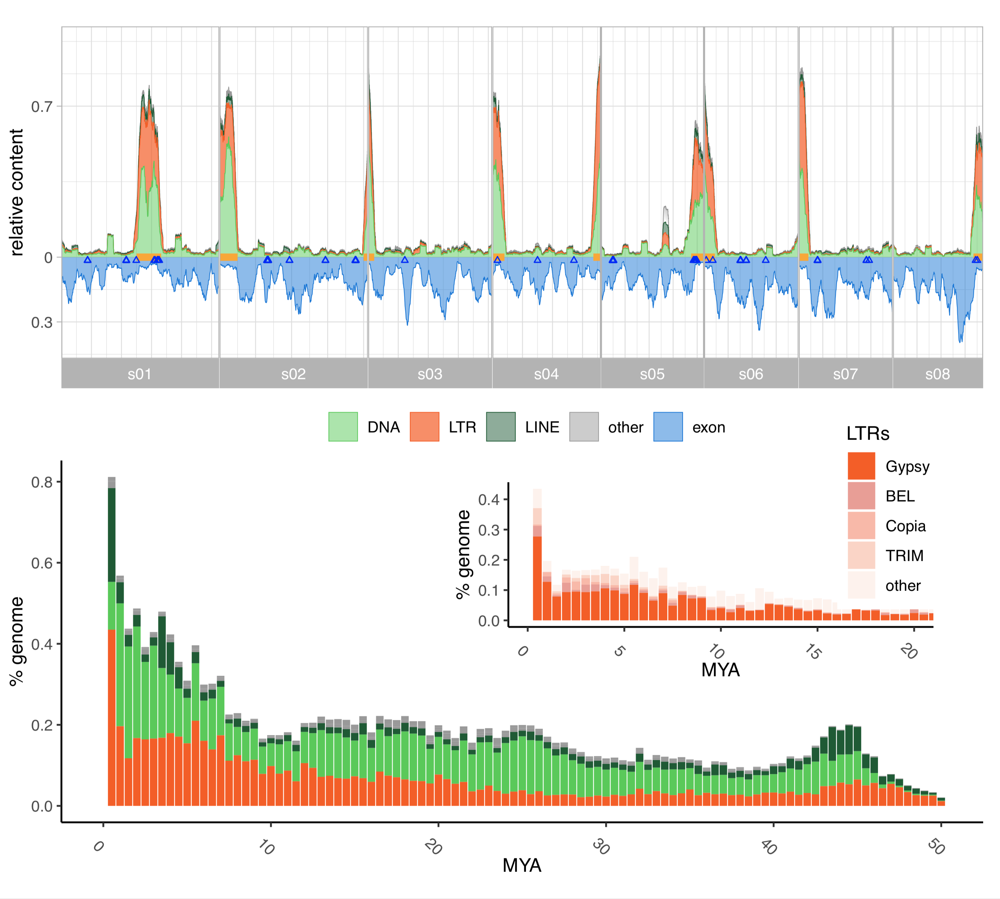
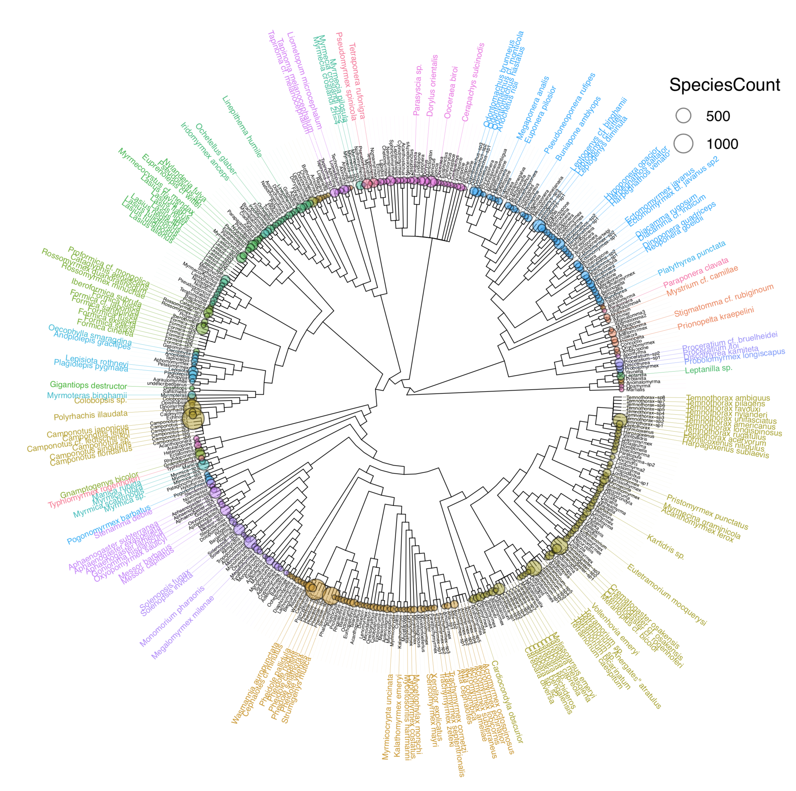
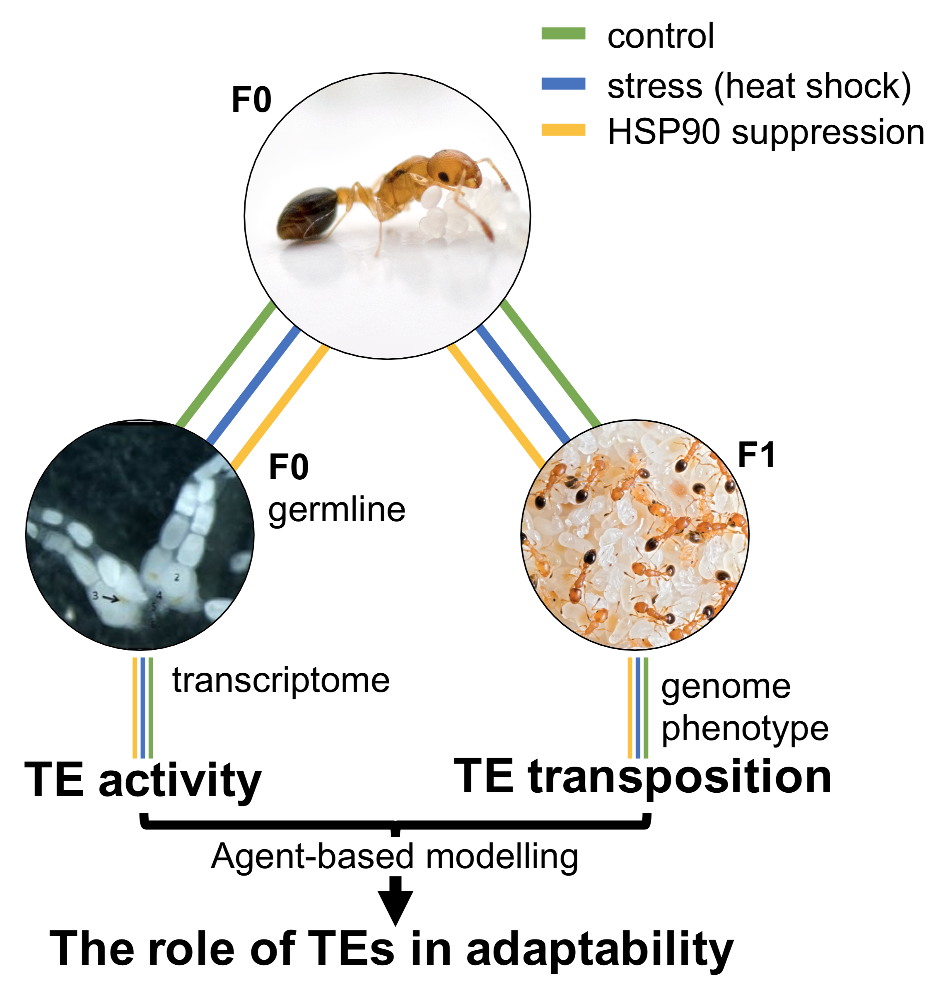
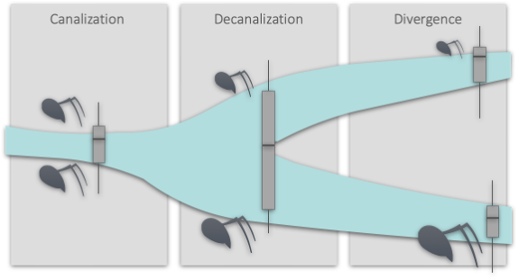

## Our Research Areas

<h3>Cardiocondylomics</h3>

We study structural and compositional genome variation in the invasive ant <i>Cardiocondyla obscurior</i>, a model organism for understanding rapid evolutionary change and genomic innovation. Structural variants (SVs)—including deletions, insertions, inversions, and translocations—are the largest source of genetic variation between individuals and a primary driver of adaptation in novel environments.

Our research focuses on how populations with small effective sizes and high inbreeding, when exposed to new habitats, can rapidly adapt through structural genomic changes. We combine comparative genomics, population genomics, and experimental evolution to uncover the mechanisms underlying adaptive evolution at the genomic level.

<h3>Ant macroevolution</h3>

The Global Ant Genomics Alliance (GAGA) is a large-scale international collaboration uniting over 120 researchers from 25 countries to generate comprehensive genomic resources for >200 ant species. GAGA integrates whole-genome assemblies, transcriptomics, microbiomics, and morphological data to provide unprecedented insights into ant evolution at the macroevolutionary scale.

These resources enable comparative analysis of genome organization and macroevolution across the ant phylogeny, revealing how genomic architecture, morphology and life histories have evolved over the last 150 million years in ants.

Read the main GAGA paper on ant genome evolution <a href="https://doi.org/10.1016/j.cell.2025.05.030">here</a> and the related AntScan paper on morphological evolution <a href="https://www.biorxiv.org/content/10.1101/2025.11.29.689474v1.abstract">here</a>.

<h3>Transposable elements and genetic innovation</h3>

Transposable elements (TEs) are powerful drivers of genomic innovation and adaptive evolution. We investigate how TEs generate genetic variation and shape genome evolution in <i>Cardiocondyla obscurior</i>, which has a compartmentalized genome with TE-rich and TE-poor regions evolving at different rates.

Our research addresses whether TEs can increase adaptability during invasion, how their activity is regulated in response to environmental stress, and the role of HSP90-mediated stress responses in facilitating TE-driven adaptation. We combine transcriptomics, genomics, and computational simulations to understand how transposable elements fuel evolutionary innovation.

<h3>Phenotypic buffering and robustness</h3>

Canalization—the capacity to maintain consistent phenotypes despite genetic and environmental variation—is a fundamental property of biological systems. We study how molecular chaperones, particularly HSP90, buffer genetic variation and regulate phenotypic robustness in the superorganism.

Our work explores whether cryptic genetic variation released through stress can facilitate adaptive evolution and whether HSP90-dependent mechanisms contribute to the remarkable adaptability of invasive ant populations.

