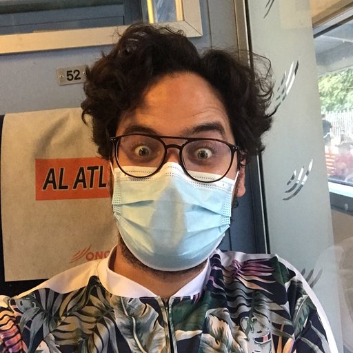
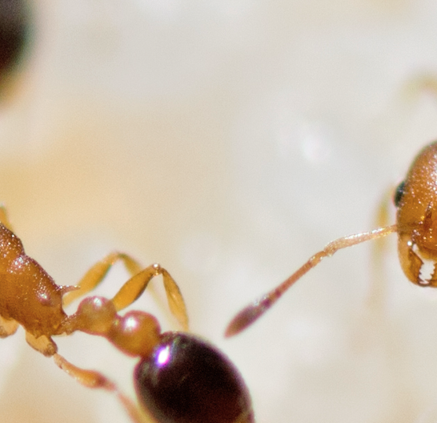

  

    <b>
  Mohammed "Simo" Errbii
  </b>  &rarr; 
  Population genomics and genome evolution in ants.  
  As a researcher, I am mainly interested in describing genetic diversity, and exploring how it is generated and its consequences on organisms. For this, I use various approaches including, but not exclusively, population genomics, comparative genomics and linkage mapping.
Most of my current work focuses on the invasive ant <i>Cardiocondyla obscurior</i>, which is characterized by its unique genome architecture, offering an unprecedented opportunity to study the genome dynamics and its consequences in this species. Additionally, I am working with the ant <i>Pogonomyrmex californicus</i>, which is characterized by a social polymorphism similar to the one described for <i>Solenopsis</i> and <i>Formica</i>, offering the opportunity to study the evolutionary dynamics of supergenes and their regulated elaborate phenotypes. I am also involved in many collaborative projects that our lab has with other groups working on non ants species (e.g. the red flower beetle <i>Tribolium castaneum</i> and the coffee berry borer <i>Hypothenemus hampei</i>). In the past, I have also worked with a semiaquatic insect (<i>Microvelia longipes</i>) which is an excellent system to study the evolution of exaggerated sexual traits.
I am a huge fan of Japanese anime and I can talk about it for days. In my free time, I enjoy cooking together and eating with friends. I also like to keep my eyes open for new adventures.
   
  

 

  

  
  <b>
  Rebecca Rothering
  </b>  &rarr; 
  The evolutionary significance of TEs in ants. 
  Transposable elements (TEs) impact genome evolution in many different ways. Amongst other things, they can disrupt or duplicate protein-coding genes, alter splicing patterns, and enhance or repress gene expression. Although many of this TE-introduced genetic variation is likely to be deleterious, it has become increasingly clear that TEs may also play an important role in adaptation, e.g. in the invasive ant <i>Cardiocondyla obscurior</i>.
This species' genome has a peculiar compartmentalized structure: in a genomic background containing only few TEs exist "TE islands", regions with high TE density and enriched in fast evolving gene families (such as olfactory receptors) considered important for the colonization of novel environments.
As part of the Global Ants Genomics Alliance (GAGA), many more ant genomes have been sequenced and comparative analyses on TE content and distribution will help us to better understand TE evolution in ants and answer questions like "Is the existence of TE islands unique to Cardiocondyla obscurior or do we find them in other (invasive) ant species as well?"
Such analyses rely on having a good TE annotation of the genomes under study in the first place, though. Usually, this involves a very time- and labour-intensive manual curation step, which is not feasible given the large number of genomes in the GAGA project. Therefore, I am currently trying to improve upon these annotations by substituting the manual curation step with a bioinformatic pipeline.
   
  

 

  

  
  <b>
  Esther van den Boes
  </b>  &rarr; 
  Rapid evolution and TE-induced genetic variation in invasive ants. 
  The constant need to adapt is met differently by each individual, population, or species. In some cases, the success at adapting is obvious, e.g. the behavioral adaptation in humans, in other instances though it can be quite puzzling. Our model organism, the invasive ant species <i>Cardiocondyla obscurior</i>, successfully colonizes new habitats even though genetic variation is low. With my project, we aim to uncover how phenotypic plasticity, cryptic variation and transposable elements (TEs) interplay during this rapid evolution and how especially TEs function as genetic innovators during adaptation.
   
  

 

  

  
  <b>
  Janina Rinke
  </b>  &rarr; 
  The impact of horizontal gene transfers in ants. 
  I am interested in the evolution of social insects and particularly in understanding the genetic basis of social insect evolution and their endosymbionts. 
In the past, I have been investigating the mechanisms of worker policing and worker reproduction in Camponotus ants.
My current research project focuses on horizontally transferred genes in ants deriving from bacteria and possible new, interesting functions of these HGTs within ants. I am using large-scale sequencing data from the Global Ant Genomics Alliance to find high-quality HGT candidates with bioinformatic methods and genomic approaches. My research tackles the question whether HGTs play a significant role in ants leading to evolutionary advances. For this, I am using RNAseq data to quantify expression of HGTs as well as molecular methods to determine the existence of high-quality HGTs.
   
  

 

  

  
  <b>
  Nic Schröder
  </b>  &rarr; 
  Ant virome evolution and evolutionary genomics of insect endosymbionts. 
  My main scientific interests revolve around ecology and evolution of host-microbe interactions. In the past I have been working on parasites and bacterial infections, but the focus of my research shifted towards evolutionary and environmental microbiology. I am particularly interested in the interplay between animal hosts and their bacterial symbionts, as well as in the dynamics of their microbiomes and viromes. In one of my current projects we use comparative genomics of bacterial insect endosymbionts to shed light on the evolutionary transition of free-living bacteria to an endosymbiotic lifestyle. My most recent project aims to characterize the viromes of 150+ ant species using a metagenomic approach on large-scale sequencing data as part of the Global Ant Genomics Alliance.
   
  

 

  

  
  <b>
  Maja Drakula
  </b>  &rarr; 
  Colony recognition and self-/non-self discrimination in invasive ants.
   
  

 

  

  
  <b>
  Nadine Kortüm
  </b>  &rarr; 
  Molecular characterization of ant LGTs.
   
  

 

  

  
  <b>
  Lukas Schrader
  </b> 
  My goal as a researcher is understanding the interplay between “hard-wired” genomic traits, environmental cues, “soft-wired” regulatory mechanisms, and the phenotype. 
   
  

  

**Former Members:**

  - **Lena Wiegert:** Canalization and phenotypic diversification in *Cardiocondyla obscurior*
  - **Svenja Kieckhäfer:** The role of cuticular hydrocarbons in desiccation resistance in ants
  - **Eyleen Wiese:** The genetic basis of CHC biosynthesis in ants
  - **Miles Winter:** HSP90/HSP70 in *Cardiocondyla obscurior*

