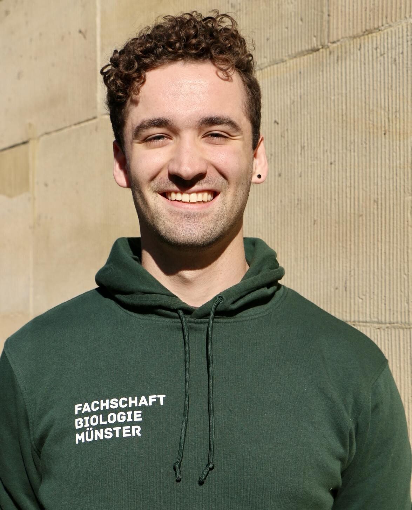

```{=html}
<div class="team-container">

<div class="team-card">
  
  <div class="team-info">
    <h3>Esther van den Bos</h3>
    <p class="role">PhD student</p>
    <p>Rapid evolution and TE-induced genetic variation in invasive ants.</p>
    <p>The constant need to adapt is met differently by each individual, population, or species. In some cases, the success at adapting is obvious, e.g. the behavioral adaptation in humans, in other instances though it can be quite puzzling. Our model organism, the invasive ant species <i>Cardiocondyla obscurior</i>, successfully colonizes new habitats even though genetic variation is low. With my project, we aim to uncover how phenotypic plasticity, cryptic variation and transposable elements (TEs) interplay during this rapid evolution and how especially TEs function as genetic innovators during adaptation.</p>
  </div>
</div>

<div class="team-card">
  
  <div class="team-info">
    <h3>Janina Rinke</h3>
    <p class="role">PhD student</p>
    <p>The evolution of genome compartmentalization in the ant genus <i>Cardiocondyla</i>.</p>
    <p>
I am working with different species of the ant <i>Cardiocondyla</i> to investigate the evolution of transposable elements in these ants. My main research goal is to get an idea how transposable elements might have influenced the genome evolution of this genus and evolution of these ants in general.
Interestingly, the genome of the ant <i>C. obscurior</i> – of which we have a high-quality genome assembly – is highly compartmentalized into slowly evolving TE-poor regions and fast-evolving TE-rich regions. By using comparative genomic, population genomic and transcriptomic studies, I am hoping to shed light on this phenomenon in <i>Cardiocondyla</i> spp and aim to unravel its effects on the species’ ability to adapt to changing environmental conditions.</p>
  </div>
</div>

<div class="team-card">
  
  <div class="team-info">
    <h3>Isabell Kaufhold</h3>
    <p class="role">MSc student</p>
    <p>Genome evolution in <i>Cardiocondyla</i> ants.</p>
  </div>
</div>

<div class="team-card">
  
  <div class="team-info">
    <h3>Nils Rensing</h3>
    <p class="role">MSc student</p>
    <p>Active TEs in superorganisms.</p>
  </div>
</div>

<div class="team-card">
  
  <div class="team-info">
    <h3>Lukas Schrader</h3>
    <p class="role">PI</p>
    <p>My goal as a researcher is understanding the interplay between "hard-wired" genomic traits, environmental cues, "soft-wired" regulatory mechanisms, and the phenotype.</p>
  </div>
</div>

</div>
```

## Former Members
- **Lukas Franke:** Horizontal gene transfer in *Cardiocondyla obscurior*.
- **Mohammed (Simo) Errbii:** Genome dynamics in insects.
- **Nanda Vo:** Transcriptomic signatures of plastic adaptation in <i>Aphidius</i> parasitoids.
- **Joshua Grebe:** Canalization and phenotypic robustness of superorganisms.
- **Sandra Tretter:** Micromorphology in ants, with an emphasis on social parasites.
- **Lena Wiegert:** Canalization and phenotypic diversification in *Cardiocondyla obscurior*
- **Svenja Kieckhäfer:** The role of cuticular hydrocarbons in desiccation resistance in ants
- **Eyleen Wiese:** The genetic basis of CHC biosynthesis in ants
- **Miles Winter:** HSP90/HSP70 in *Cardiocondyla obscurior*
- **Maja Drakula:** The role of CHCs in aggressive interactions in *Cardiocondyla obscurior*
- **Rebecca Rothering:** The evolutionary significance of TEs in ants
- **Nic Schröder:** Ant virus evolution
